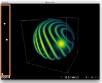
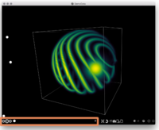
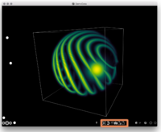
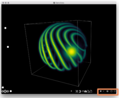
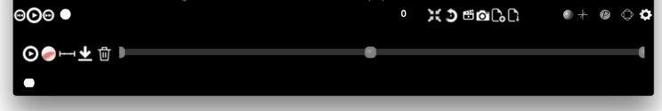

# Spimagine


*Spimagine* is a python package to interactively visualize and process  time lapsed volumetric data as generated with modern light sheet microscopes (hence the *Spim* part). The package provides a generic 3D+t data viewer and makes use of GPU acceleration via OpenCL. 
If provides further an image processor interface for the GPU accelerated denoising and deconvolution methods of [gputools](https://github.com/maweigert/gputools). 

Watch the following screencast for a first impression: 

<p align="left">
<a href = https://vimeo.com/126597994 ></a>
</p>

or alternatively the [talk at EuroScipy 2015](https://www.youtube.com/watch?v=MeFsmFTU2JQ)


## Overview

[Requirements](#requirements)  
[Installation](#installation)  
[Usage](#usage)


## Requirements

* Python 2.7 or 3.5+ (recommended)
* a working OpenCL environment 


## Installation

### Mac


#### Verify the availability of OpenCL
On OSX the neccessary OpenCL libraries should be provided by default. 
Check with `clinfo` that your GPU is listed as available device:
```
brew install clinfo
clinfo
```
####  Install the package
If you only want to use the standalone application (without installing it as a proper python package and make it usable from within the interpreter) you can just download the [App bundle](https://github.com/maweigert/spimagine/releases/download/v0.2.3/spimagine_v0.2.3.dmg):


To install it as a proper package, do

* Python 2
```
brew install pyqt5 --with-python --without-python3
pip install spimagine
```

* Python 3
```
pip3 install spimagine
```

For the most recent versions, install the developmental branch 
```
pip(2|3) install git+https://github.com/maweigert/spimagine@develop
```


### Linux

#### Verify the availability of OpenCL

Check with `clinfo` that your GPU is listed as available device:
```
sudo apt-get install clinfo
clinfo
```
Depending on your graphics card, install relevant the opencl libaries, headers and icd, e.g. for nvidia

```
sudo apt-get install opencl-header  nvidia-libopencl1-352 nvidia-opencl-icd-352
```

On https://wiki.tiker.net/OpenCLHowTo you can find some further information

####  Install the package

* Python 2

```
sudo apt-get install python-pyqt5 python-pyqt5.qtopengl python-pyqt5.qtsvg
pip install spimagine
```

* Python 3

```
pip3 install spimagine
```


### Windows

Install the OpenCL SDK of your graphcis card vendor.
Install pyopencl and PyQt5 prebuilt binaries from http://www.lfd.uci.edu/~gohlke/pythonlibs/

```
git clone https://github.com/maweigert/gputools.git
cd gputools
python setup.py install

git clone https://github.com/maweigert/spimagine.git
cd spimagine
python setup.py install
```

## Anaconda Installation

Spimagine can also be installed using the ```conda``` package manager.

1. Install [Anaconda](https://www.anaconda.com/download/), (it doesn't matter whether you download anaconda with Python 2 or 3, you can still install Spimagine in a virtual environment using either Py 2/3).
2. Launch a ```terminal``` window (OS X, Linux), or ```Anaconda Prompt``` (Windows)
3. Install Spimagine into a new environment:

```bash
> conda create -n spimenv -c talley -c conda-forge python=3.6 spimagine
```

The ``create -n spimenv`` line creates a virtual environment.  This is optional, but strongly recommended as it easier to uninstall cleanly and prevents conflicts with any other python environments.  If installing into a virtual environment, you must source the environment each time before using Spimagine (as shown below in step 4).

*Note:  To prevent the need to type ```-c talley -c conda-forge``` every time you update/install spimagine, you may also add those channels to your config as follows:*

```bash
> conda config --add channels conda-forge
> conda config --add channels talley
```

then future installs/updates can be run simply via:

```bash
> conda update spimagine
```


4. The gui can be launched with ``spimagine``.  You can create a bash script or batch file to autoload the environment and launch the program if desired.

```bash
# Launch Anaconda Prompt and activate the spimagine virtual environment...
> activate spimenv  # Windows
$ source activate spimenv  # OS X or Linux

# launch the gui
> spimagine
```

### Some notes on troubleshooting the anaconda installation:

The hardest thing to get "right" is the pyopencl installation, which often requires system-specific tinkering, based on your hardware and drivers.  On Windows, the conda package will default to pyopencl 2017.2 with the precompiled OpenCL 1.2 binaries from [Christoph Gohlke](http://www.lfd.uci.edu/~gohlke/pythonlibs/).  This works well for most current NVIDIA GPUs, but if you experience issues (most commonly, you will see "\_cffi" errors), you may need to use a different pyopencl version, that better match your drivers.  To see all of the options for your platform, type the following at the anaconda prompt:

```bash
> conda search -c conda-forge pyopencl
```

Then, if you'd like to try a different version, for (openCL v2.0 in the example below) uninstall pyopencl and reinstall a specific version like this:

```bash
> conda remove --force pyopencl
> conda install -c conda-forge pyopencl=2017.2
```


The other common bug (most frequently seen on Windows 10) is an OpenGL version mismatch.  This is a problem that is currently unsolved.  See [this thread](https://github.com/maweigert/spimagine/issues/24) to report this bug and track any potential fixes/updates.

## Usage

Spimagine was designed with the interactive display of volumetric data from ipython in mind, but it can likewise be used as a standalone application.  

### Standalone Application

pip should install the standalone viewer in the local bin folder (e.g. "~/.local/bin" on Linux), run it from the command line like that

```
spimagine [input]
```

Right now the following formats are supported as input 

- tiff files
- a folder containing tiff files
- 16 bit unsigned raw data in the format used by the Myers Group at mpi-cbg


### Interactive 

the package provides interactive visualisation to be used e.g. within IPython

```python 
from spimagine import volshow
import numpy as np

# create a 3d or 4d numpy array
data = np.linspace(0,1,100**3).reshape((100,)*3)          
	
# render the data and returns the widget 
w = volshow(data)       

# manipulate the render states, e.g. rotation and colormap
w.transform.setRotation(.1,1,0,1)
w.set_colormap("hot")

# save the current view to a file  
w.saveFrame("scene.png")
````

### GUI

To load a file (supported: Tiff/czi) just drop it onto the main canvas or use the load button on the middle bottom panel. 

| | | | |
|-------|-------|-------|-----|
|||||
| <ul><li>min/max/gamma slider</li></ul> | <ul><li>timepoint controls</li></ul> | <ul><li>center/animate view</li><li>keyframe editor</li><li>screenshot</li><li>open/save as tiff</li></ul> | <ul><li>iso surface</li><li>slice view</li><li>settings</li></ul> |

#### keyframe editor

*Spimagine* allows the creation of animated sequences of rendering scenes via its keyframe editor. 
After opening the panel, different keyframes can be inserted by right clickling on the timeline. A right click on existing keyframe will open a context menu to update the keyframe or change the interpolation elasticity (the acceleration if the interpolation). Every change in the transform parameters (zoom, gamma, etc) and data timepoints will then be interpolated between consecutive keyframes. Pressing the play button will animate the sequence, pressing the record button will save the rendered images to a folder (set the framerate and folder location in the settings panel) after which they can be composed into a movie (e.g. with ffmpeg). The current keyframes can be saved to json (via a button) and reloaded (drop the json into the timeline).



### configuration 

Some configuration data (e.g. the default OpenCL platform and device, colormaps, etc) can be changed in the config file `$HOME/.spimagine` (create it if necessary)  

```#~/.spimagine

id_platform = 0  
# id_platform =-1 to choose the device with biggest memory) 

id_device = 1 
max_steps  = 400
colormap = viridis

```
See 
```python
spimagine.config.defaults
```
for available keys and their defaults.

As *Spimagine* uses [gputools](https://github.com/maweigert/gputools) as OpenCL backend, it will use gputools' default OpenCL platform/device otherwise (which itself can be changed in `$HOME/.gputools`)


### troubleshooting

#### logging (verbose mode)

To get a logging output, run it as standalone from the command line with the verbose flag  (-v) set
```
$ spimagine -v
```


#### getting it to work from inside the jupyter notebook / ipython 

As the main widget relies on the qt event loop running, one has to include 

```python
%gui qt5
```
at the beginning of the notebook or start Ipython with the qt5 backend:

```
ipython --matplotlib=qt5
```

#### widget is blank/black on OSX with Nvidia Web driver

If you use Nvidias Wed Driver on Osx, you might see a blank canvas which is apparently due to a bug in the OpenCL implementation.
The workaround so far is to set the flag 
```
_qualifier_constant_to_global = 1
```
in `$HOME/.spimagine`
