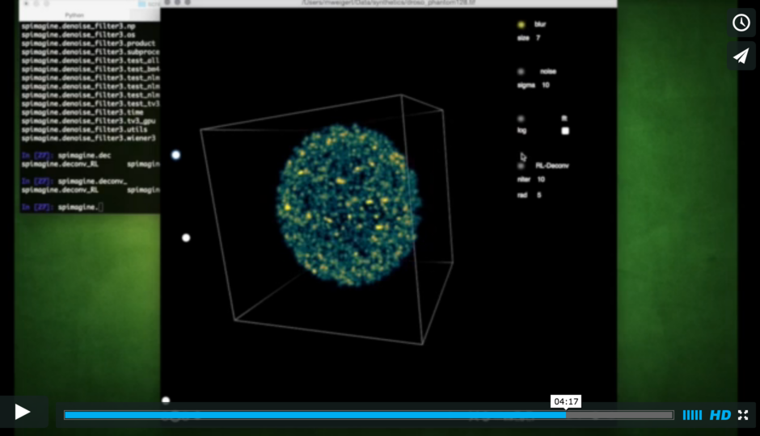

# Spimagine
[Overview](#overview)  
[Requirements](#requirements)  
[Installation](#installation)  
[Usage](#usage)

## Overview

*Spimagine* is a python package to interactively visualize and process  time lapsed volumetric data as generated with modern light sheet microscopes (hence the *Spim* part). The package provides a generic 3D+t data viewer and makes use of GPU acceleration via OpenCL. 
If provides further an image processor interface for the GPU accelerated denoising and deconvolution methods of [gputools](https://github.com/maweigert/gputools). 

Watch the following screencast for a first impression: 

[](https://vimeo.com/126597994)


## Requirements

Python 2 + a working OpenCL environment 

#### Mac

OpenCL should be provided by default :)

#### Linux
e.g. for nvidia cards, install the latest drivers and then the opencl lib/headers

```bash
sudo apt-get install opencl-header  nvidia-libopencl1-35 nvidia-opencl-icd-352
	
sudo modprobe nvidia-352-uvm
```

until clinfo shows your GPU as a valid OpenCL device:
```
sudo apt-get install clinfo
sudo clinfo
```


## Installation

### Mac

install PyQt4, e.g. with homebrew:
```
brew install pyqt
```

then with pip
```
pip install git+https://github.com/maweigert/gputools
pip install git+https://github.com/maweigert/spimagine
```

or the developmental branch (recommended)
```
pip install git+https://github.com/maweigert/spimagine@develop
```
	
### Linux

```
apt-get install python-qt4 python-qt4-gl

pip install git+https://github.com/maweigert/gputools
pip install git+https://github.com/maweigert/spimagine@develop
```

### Windows

install pyopencl and PyQt4 prebuilt binaries from http://www.lfd.uci.edu/~gohlke/pythonlibs/

```
git clone https://github.com/maweigert/gputools.git
cd gputools
python setup.py install

git clone https://github.com/maweigert/spimagine.git
cd spimagine
python setup.py install
```


## Usage

Spimagine was designed with the interactive display of volemtric data from ipython in mind, but it can likewise be used as a standalone application.  

### Standalone Application

pip should install the standalone viewer in the local bin folder (e.g. "~/.local/bin" on Linux), run it from the command line like that

```
spimagine [input]
```

Right now the following formats are supported as input 

- tiff files
- a folder containing tiff files
- 16 bit unsigned raw data in the format used by the Myers Group at mpi-cbg


### Interactive 

the package provides interactive visualisation to be used e.g. within IPython

```python 
from spimagine import volshow

data = linspace(0,1,100**3).reshape((100,)*3)          #3d or 4d numpy array
	
volshow(data)       #render the data
````

### GUI


### configuration 

the default parameters (colormap/render width...) can be set by creating the config file "$HOME/.spimagine" and populating it with the default values, e.g.

```
opencldevice = 0
max_steps  = 200
width = 600
colormap = hot
```
